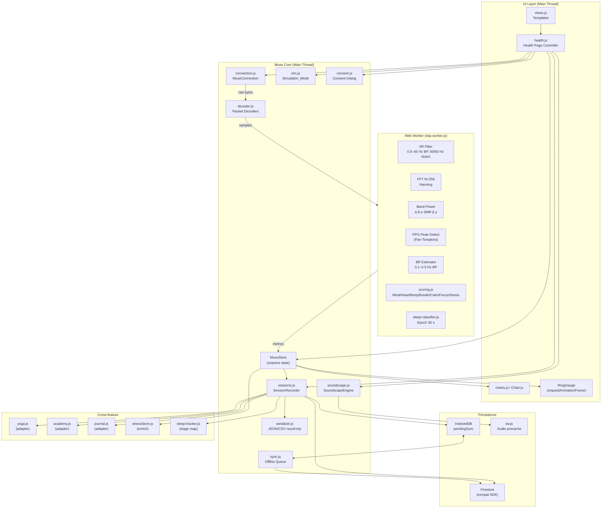
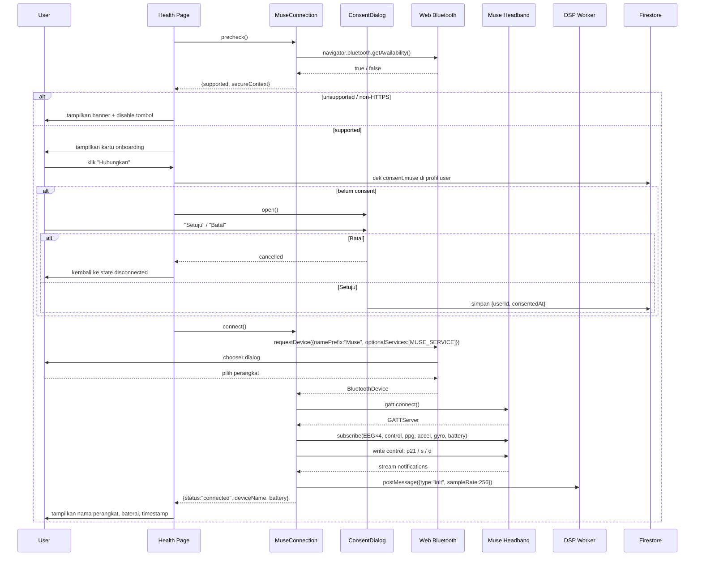
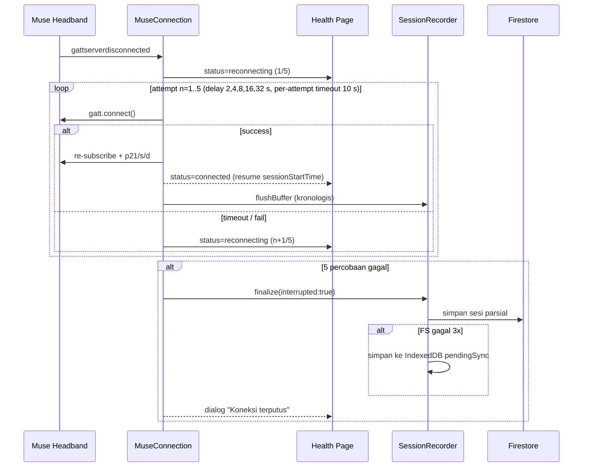
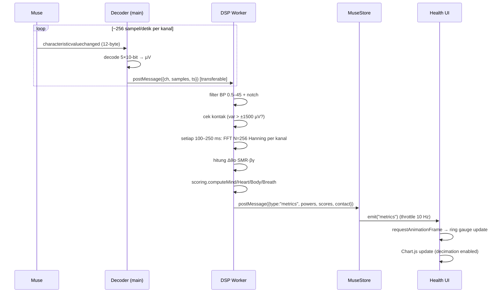
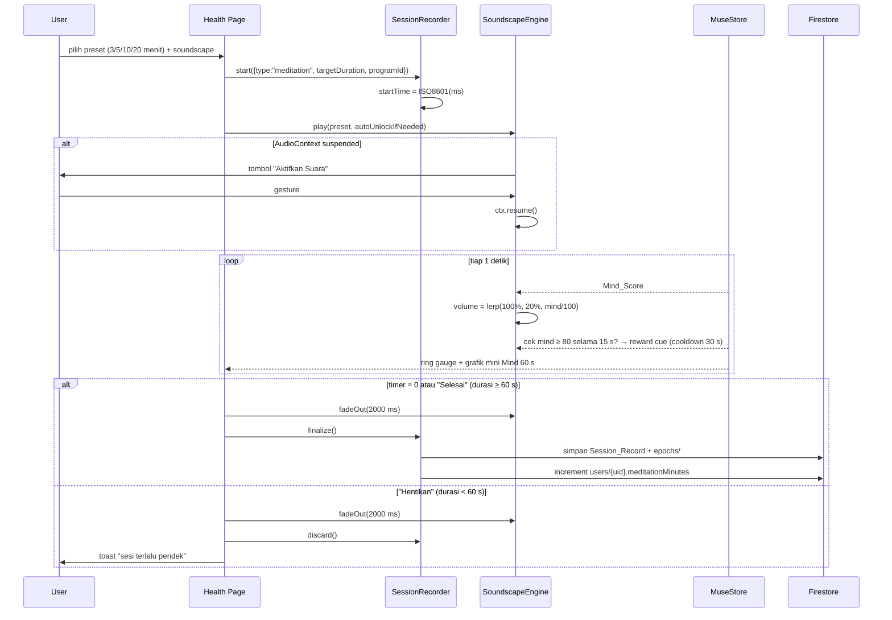
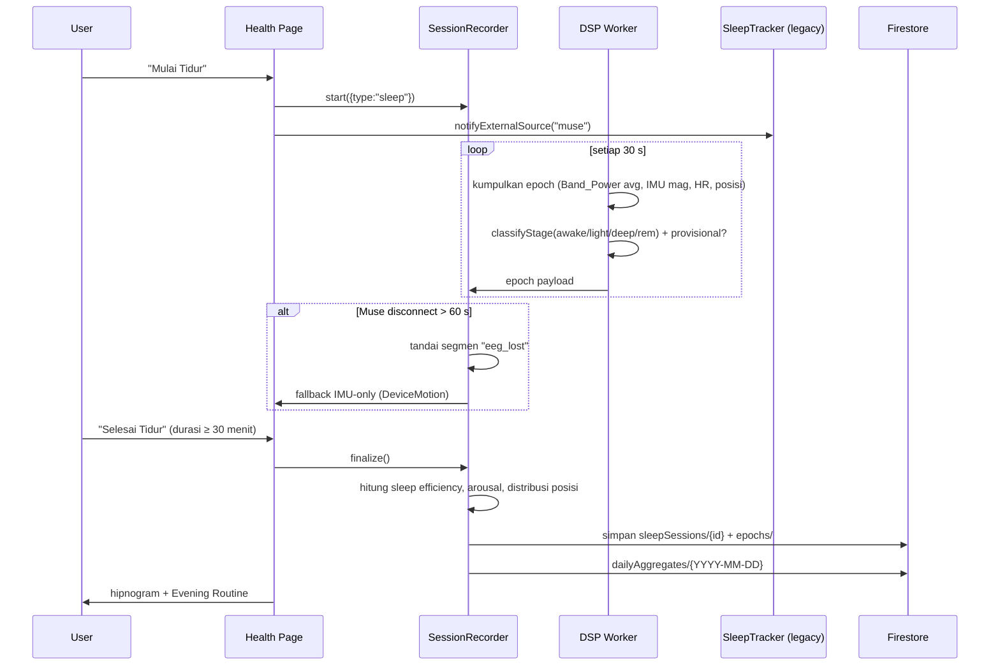
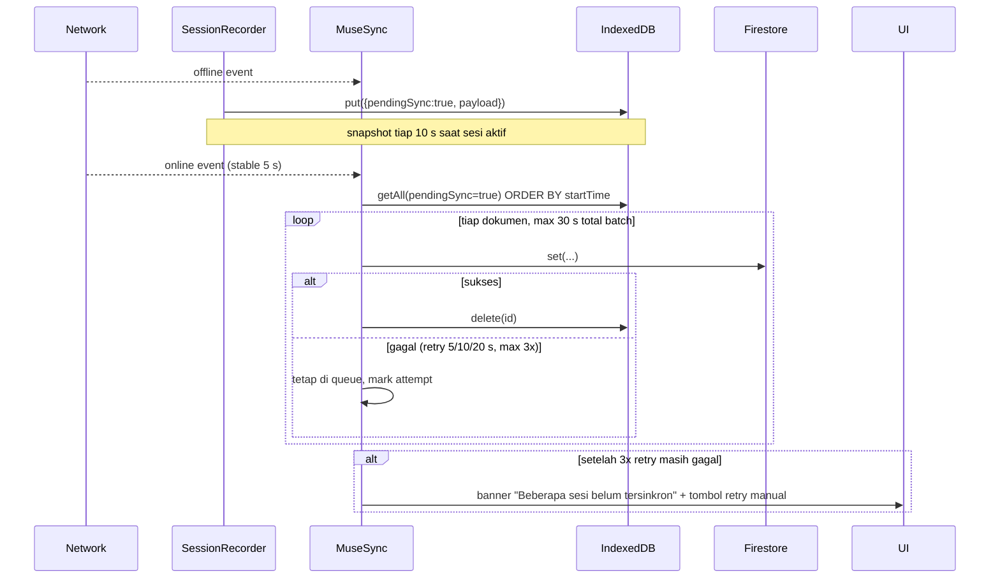

# Design Document

## Overview

Dokumen desain ini diorganisasi dalam 18 bagian bernomor. Untuk kepatuhan format spec Kiro, bagian-bagian utama juga dapat diakses melalui jangkar berikut:

- `## Architecture` → bagian 2 (Arsitektur Modul) dan bagian 3 (Alur Sequence Utama).
- `## Components and Interfaces` → bagian 4 (Spesifikasi BLE & Decoding) dan bagian 11 (UI/UX Health Page).
- `## Data Models` → bagian 7 (Model Data & Skema Firestore) dan bagian 8 (Round-trip Serializer).
- `## Correctness Properties` → bagian 16.2 (Property-based Tests).
- `## Error Handling` → bagian 14 (Privasi & Keamanan) dan bagian 18 (Risiko).
- `## Testing Strategy` → bagian 16 (Strategi Testing).

## 1. Ringkasan Desain

Dokumen ini menjabarkan desain teknis untuk integrasi Muse S Gen 2 ke dalam halaman Health aplikasi ScentraVN Serenity, sesuai dengan 23 requirement pada `requirements.md`. Desain memetakan setiap requirement ke area teknis berikut:

| Area Desain | Modul Baru / Diubah | Requirement |
|---|---|---|
| BLE Layer & Pairing | `js/muse/connection.js` | R1, R2, R3, R7 (IMU input) |
| Decoder Paket Muse | `js/muse/decoder.js` | R4, R5, R6, R7 |
| Signal Processing (Web Worker) | `js/muse/dsp.worker.js` | R4, R5, R6, R8, R10, R19 |
| Skema Skor | `js/muse/scoring.js` | R8, R10, R13 |
| Sleep Staging | `js/muse/sleep-classifier.js` (di Worker) | R11 |
| Recorder Sesi & Round-trip | `js/muse/sessions.js`, `js/muse/serializer.js` | R9, R10, R11, R14, R16, R23 |
| Soundscape Adaptif | `js/muse/soundscape.js` | R9, R12 |
| Mode Simulasi | `js/muse/sim.js` | R20 |
| Sinkronisasi Offline | `js/muse/sync.js`, `sw.js` | R17 |
| UI Health Page | `js/health.js` (modifikasi), `js/views.js` (template baru) | R4, R8, R9, R10, R11, R14, R15, R19, R21 |
| Cross-feature | `js/yoga.js`, `js/academy.js`, `js/journal.js` (adapter) | R10, R13, R15 |
| Privasi & Konsens | `js/muse/consent.js` | R18, R22 |
| Persistensi Firestore | `firestore.rules`, `firestore.indexes.json` | R14, R16, R17 |
| i18n & Aksesibilitas | `js/i18n.js` (penambahan key) | R21 |

**Prinsip arsitektur:**
- **Adapter, bukan rewrite.** `eeg-muse.js` lama tetap dipertahankan sebagai shim agar kontrak `MuseEEG` tidak pecah. Modul baru dipanggil melalui adapter di `multi-ble.js`.
- **Pure functions di Worker.** Semua DSP (FFT, filter, peak detection) dan klasifikasi sleep adalah fungsi murni yang dapat diuji unit dan property-based tanpa BLE.
- **Single Source of Truth.** State Muse (skor, status, baterai) disimpan di `MuseStore` (mengikuti pola `stressStore.js`), bukan di DOM.
- **Feature flag.** Aktivasi v2 di balik flag `?muse=v2` atau `localStorage.museV2 = '1'` agar rollout bertahap.

## 2. Arsitektur Modul

## Architecture

> Bagian ini diorganisasi dalam dua sub-bagian: 2 (Arsitektur Modul, struktur statis) dan 3 (Alur Sequence Utama, struktur dinamis). Heading "Architecture" di atas adalah jangkar kepatuhan format.



**Klasifikasi modul:**

| Modul | Status | Path |
|---|---|---|
| `MuseConnection` | Baru | `js/muse/connection.js` |
| `MuseDecoder` | Baru (mengekstrak logika dari `eeg-muse.js`) | `js/muse/decoder.js` |
| `MuseDSP` Worker | Baru | `js/muse/dsp.worker.js` |
| `MuseScoring` | Baru | `js/muse/scoring.js` |
| `SleepClassifier` | Baru (dipanggil dari worker) | `js/muse/sleep-classifier.js` |
| `SessionRecorder` | Baru | `js/muse/sessions.js` |
| `SessionSerializer` | Baru | `js/muse/serializer.js` |
| `SoundscapeEngine` | Baru | `js/muse/soundscape.js` |
| `MuseSim` | Baru (mengganti `_simInterval` di `eeg-muse.js`) | `js/muse/sim.js` |
| `MuseSync` | Baru | `js/muse/sync.js` |
| `MuseConsent` | Baru | `js/muse/consent.js` |
| `MuseStore` | Baru | `js/muse/store.js` |
| `eeg-muse.js` | Diubah → menjadi shim adapter | `js/eeg-muse.js` |
| `multi-ble.js` | Diubah → memanggil `MuseConnection` v2 | `js/multi-ble.js` |
| `health.js` | Diubah → render kartu baru, tab Riwayat & Insight | `js/health.js` |
| `views.js` | Diubah → tambahkan template Health v2 | `js/views.js` |
| `sleep-tracker.js` | Diubah → menerima `stageMap` dari Muse | `js/sleep-tracker.js` |
| `stressStore.js` | Diubah → menerima Stress_Score gabungan | `js/stressStore.js` |
| `yoga.js`, `academy.js`, `journal.js` | Diubah → menerima konteks dari `MuseStore` | masing-masing |
| `sw.js` | Diubah → tambah aset audio Muse di STATIC_ASSETS | `sw.js` |
| `firestore.rules` | Diubah → koleksi baru di bawah `users/{uid}/` | `firestore.rules` |
| `firestore.indexes.json` | Diubah → indeks baru | `firestore.indexes.json` |
| `i18n.js` | Diubah → key baru namespace `muse.*` | `js/i18n.js` |
| `ble-connection.js` | Tidak diubah | `js/ble-connection.js` |
| `audio-queue.js`, `audio-analyser.js` | Tidak diubah (digunakan sebagai dependency) | masing-masing |
| `firebase-config.js` | Tidak diubah | `js/firebase-config.js` |


## 3. Alur Sequence Utama

### 3.1 Pairing & First Connect (R1, R2, R18)



### 3.2 Reconnect Exponential Backoff (R3)



### 3.3 Streaming EEG → Worker → Metric → UI (R4, R8, R19)



### 3.4 Sesi Meditasi + Soundscape (R9, R12)



### 3.5 Sesi Sleep + Classifier per Epoch (R11)



### 3.6 Offline → Online Flush (R17)



### 3.7 Hapus Seluruh Data Muse (R18)

```mermaid
sequenceDiagram
  participant U as User
  participant HP as Health Page
  participant CONF as ConfirmDialog
  participant FS as Firestore

  U->>HP: menu "Privasi & Data" → "Hapus seluruh data Muse"
  HP->>FS: count(meditationSessions, focusSessions, sleepSessions, breathSessions, dailyAggregates, museBaseline)
  FS-->>HP: jumlah dokumen
  HP->>CONF: tampilkan jumlah + tombol "Hapus"
  U->>CONF: konfirmasi
  CONF->>FS: WriteBatch (batch ≤500 ops, chunked)
  alt seluruh batch sukses
    FS-->>HP: ringkasan jumlah terhapus
    HP->>U: toast sukses
  else satu batch gagal
    HP->>HP: tandai error, hentikan delete sisa, tampilkan peringatan
    Note over HP,FS: Firestore tidak punya transaksi atomik > 500 ops; gunakan idempoten + log untuk re-run
  end
```


## 4. Spesifikasi BLE & Decoding Muse S Gen 2

## Components and Interfaces

> Komponen dan kontrak antar-modul dijabarkan di bagian 4 (BLE & Decoder), bagian 11 (UI/UX Health Page), serta kontrak `MuseConnection` di sub-bagian 4.5. Heading di atas adalah jangkar kepatuhan format.

### 4.1 GATT UUID

| Karakteristik | UUID |
|---|---|
| Service utama | `0000fe8d-0000-1000-8000-00805f9b34fb` |
| Control | `273e0001-4c4d-454d-96be-f03bac821358` |
| EEG TP9 | `273e0003-...` |
| EEG AF7 | `273e0004-...` |
| EEG AF8 | `273e0005-...` |
| EEG TP10 | `273e0006-...` |
| Battery | `273e000b-...` |
| Gyroscope | `273e0009-...` |
| Accelerometer | `273e000a-...` |
| PPG (Gen 2) | `273e000f-...`, `273e0010-...`, `273e0011-...` (3 kanal) |

### 4.2 Format Paket EEG (12 byte)

```
byte 0..1   : sequence number (uint16 BE)
byte 2..11  : 5 sampel × 10-bit, packed big-endian
```

### 4.3 Kontrol (perintah Muse)

```
"X" + cmd + "\n", panjang dikirim sebagai prefix
  p21  : preset Gen 2 (EEG + PPG + IMU)
  s    : status
  d    : start streaming
  h    : halt
```

### 4.4 Pseudocode Decoder

```js
// js/muse/decoder.js — pure functions, testable tanpa BLE
export function decodeEegPacket(view /* DataView 12 byte */) {
  const seq = view.getUint16(0, false);
  const samples = new Float32Array(5);
  for (let i = 0; i < 5; i++) {
    const bitStart = i * 10;
    const byteOff = 2 + (bitStart >>> 3);
    const bitOff = bitStart & 7;
    const hi = view.getUint8(byteOff);
    const lo = view.getUint8(byteOff + 1);
    let raw = ((hi << 8) | lo) >>> (6 - bitOff);
    raw &= 0x3FF;                       // 10-bit
    samples[i] = (raw - 512) * 0.48828125; // µV (Muse ADC, ref 1.2 V)
  }
  return { seq, samples };
}

export function decodePpgPacket(view) { /* sama pola, 3 sampel × 16-bit */ }

export function decodeImuPacket(view) {
  // 3 sampel × 6 axis × 16-bit signed
  const out = [];
  for (let i = 0; i < 3; i++) {
    const o = i * 12;
    out.push({
      ax: view.getInt16(o + 0, false) / 16384, // ±2 g
      ay: view.getInt16(o + 2, false) / 16384,
      az: view.getInt16(o + 4, false) / 16384,
      gx: view.getInt16(o + 6, false) / 131,   // ±2000 dps
      gy: view.getInt16(o + 8, false) / 131,
      gz: view.getInt16(o + 10, false) / 131,
    });
  }
  return out;
}

export function decodeBattery(view) {
  return view.getUint16(0, false) / 512; // %
}
```

### 4.5 Kontrak `MuseConnection`

```js
class MuseConnection {
  // events: 'connection', 'eeg', 'ppg', 'imu', 'battery', 'error', 'stalled'
  on(event, cb) {}
  off(event, cb) {}

  async precheck()                 // R1: { supported, secureContext }
  async connect()                  // R2: pairing, subscribe, p21/s/d
  async reconnect()                // R3: digunakan internal, juga publik
  async disconnect()               // R2.8: send 'h', cleanup
  getDevicesAlreadyAuthorized()    // R1.4: navigator.bluetooth.getDevices()
  getStatus()                      // {state, deviceName, battery, contact}
}
```

## 5. Signal Processing

Semua DSP berjalan di `js/muse/dsp.worker.js` agar main thread tetap responsif (R19).

### 5.1 Filter

- **Band-pass 0.5–45 Hz**: Butterworth orde 4, diimplementasikan sebagai dua biquad cascade dalam bentuk Direct Form II Transposed.
- **Notch 50/60 Hz**: dua biquad notch (Q=30) dipilih runtime berdasarkan `navigator.language` (default 50 Hz; 60 Hz untuk locale `en-US`/`en-CA`/`pt-BR`).
- Filter berstateful per kanal; reset saat reconnect.

### 5.2 FFT

- N=256 (1 detik @ 256 Hz), Hanning window pre-applied.
- Algoritma: Cooley-Tukey radix-2 (sudah ada di `eeg-muse.js`, dipindah ke worker).
- Resolusi frekuensi: `fs/N = 1.0 Hz/bin`.

### 5.3 Band Power

| Band | Rentang Hz | Bin (N=256, fs=256) |
|---|---|---|
| Delta | 0.5–4 | 0–4 |
| Theta | 4–8 | 4–8 |
| Alpha | 8–13 | 8–13 |
| SMR | 13–15 | 13–15 |
| Beta | 13–30 | 13–30 |
| Gamma | 30–45 | 30–45 (dibatasi 45 oleh BP) |

Power dihitung sebagai `Σ |X[k]|² / N²` lalu dikalikan `1e6` (skala layar). Output: objek `{delta, theta, alpha, smr, beta, gamma, alphaPeak}` per channel + rata-rata frontal `(AF7+AF8)/2`.

### 5.4 BR (Breath Rate)

- Sumber utama: PPG envelope (Hilbert lite via moving RMS 0.5 s).
- Sumber fallback: accelerometer Z-axis low-pass.
- Filter: band-pass 0.1–0.5 Hz (4–30 brpm).
- Estimasi: jumlah puncak dalam jendela 30 s × 2 (= per menit), update setiap 5 s.
- Status `low_quality` jika di luar 4–30 brpm > 60 s; pulih jika 30 s berturut dalam rentang.

### 5.5 PPG Peak Detection (Pan-Tompkins simplified)

```
1. Band-pass 5–15 Hz
2. Derivative (1st difference)
3. Square
4. Moving Window Integration (150 ms)
5. Adaptive threshold: thr = 0.3 × maxLast8 dengan refractory 300 ms
6. Output: timestamp puncak (ms)
```

HR = `60000 / mean(RR_last8)`, integer.
RMSSD = `sqrt(mean(diff(RR_last30)²))`, 1 desimal, recompute setiap 5 s. Status `warming_up` jika kurang dari 30 RR.

## 6. Skema Skor

Semua skor di-clamp ke `[0, 100]`. Dihitung di `js/muse/scoring.js` (dapat diuji murni; juga digunakan di worker).

| Skor | Rumus | Trigger |
|---|---|---|
| Mind_Score | `clamp(0, 100, 100 − 7 × (theta/beta − 1))` dari rata-rata AF7+AF8 | tiap update Band_Power |
| Heart_Score | linear: 100 saat RMSSD ≥ baseline+1σ; 50 saat baseline; 0 saat ≤ baseline−1σ; `provisional` saat baseline default | tiap update RMSSD (5 s) |
| Body_Score | `clamp(0, 100, 100 × (1 − min(1, magNorm)))` dengan `magNorm = (|‖a‖−1g| / 0.3)` | tiap 1 s |
| Breath_Score | `clamp(0, 100, 100 − 12 × |BR − target_BR|)` (target 4–10 brpm, default 6) | tiap update BR (5 s) |
| Calm_Score | `0.4·Mind + 0.2·Heart + 0.2·Body + 0.2·Breath` | tiap 1 s saat sesi meditasi |
| Focus_Score | linear: rasio SMR/Alpha; ≤0.5 → 0; ≥1.5 → 100 | tiap 1 s saat sesi fokus |
| Stress_Score | `0.6·EEGStress + 0.25·HRStress + 0.15·GSRStress`; jika GSR tidak tersedia, redistribusi → 0.7 EEG + 0.3 HR | tiap 1 s |

`EEGStress` = mapping rasio Theta/Beta ke 0–100 (≤2.5 → 0, ≥9.5 → 100, linear).
`HRStress` = `clamp(0, 100, ((HR − HR_baseline) / (0.5 × HR_baseline)) × 100)`.
`GSRStress` = output existing `stressCalculator.gsrScore` (0–100).

Tabel input → output (sanity):

| Skenario | Theta | Beta | RMSSD | mag g | BR | HR | Mind | Heart | Body | Breath | Calm | Stress |
|---|---|---|---|---|---|---|---|---|---|---|---|---|
| calm  | 6 | 12 | 50 | 1.00 | 6 | 60 | 100 | ~85 | 100 | 100 | 97 | 10 |
| neutral | 10 | 10 | 35 | 1.05 | 10 | 70 | 93 | 50 | 83 | 52 | 74 | 35 |
| stressed | 18 | 6 | 20 | 1.20 | 16 | 90 | 0 | ~15 | 33 | 0 | 10 | 85 |
| focused | 6 | 14 | 45 | 1.02 | 8 | 65 | 100 | 75 | 93 | 76 | 90 | 18 |

## 7. Model Data & Skema Firestore

## Data Models

> Model data lengkap dijabarkan di bagian 7 (Firestore + IndexedDB) dan bagian 8 (JSON/CSV serializer). Heading di atas adalah jangkar kepatuhan format.

Seluruh dokumen disimpan di bawah `users/{uid}/...` agar konsisten dengan aturan `firestore.rules` yang sudah ada (wildcard `match /{subcollection}/{docId}`). Ini meminimalkan perubahan rules.

### 7.1 Sub-collection per user

```
users/{uid}/
  meditationSessions/{sessionId}
  focusSessions/{sessionId}
  sleepSessions/{sessionId}        ← juga dipakai SleepTracker existing
  breathSessions/{sessionId}
  dailyAggregates/{YYYY-MM-DD}
  museBaseline/profile             ← satu doc
  museConsent/profile              ← satu doc
```

### 7.2 Skema `Session_Record` (umum)

```jsonc
{
  "schemaVersion": 1,
  "userId": "uid",
  "sessionType": "meditation",          // meditation|focus|sleep|breath
  "device": "muse-s-gen2",
  "deviceName": "Muse-1234",
  "startTime": "2025-..ISO8601..Z",
  "endTime":   "2025-..ISO8601..Z",
  "durationSeconds": 1200,
  "status": "completed",                // completed|interrupted|discarded
  "interrupted": false,
  "sensorless": false,
  "sensorDisconnectedDuringSession": false,
  "simulated": false,
  "programId": "guided-10",             // hanya meditation
  "metricsSummary": {
    "mindAvg": 71, "mindPeak": 92, "mindMin": 35,
    "heartAvg": 64, "heartProvisional": false,
    "bodyAvg": 88,
    "breathAvg": 76, "brAvgBrpm": 6.2, "brInTargetPct": 71,
    "calmAvg": 73, "calmPeak": 95,
    "focusAvg": null,
    "stressAvg": 32, "stressPeak": 58, "stressMin": 18,
    "categoryDist": {"calm": 540, "neutral": 480, "active": 180},
    "rewardCues": 4,
    "contactGoodPct": 96
  },
  "createdAt": "<serverTimestamp>",
  "updatedAt": "<serverTimestamp>"
}
```

### 7.3 Sub-collection `epochs/`

Sesi non-sleep menyimpan rangkuman 30 detik (≤ 240 epoch per sesi 2 jam). Sleep menyimpan satu epoch per 30 detik untuk hipnogram.

```jsonc
// users/{uid}/{coll}/{sessionId}/epochs/{epochIndex}
{
  "epochIndex": 12,
  "tStart": 360,                  // detik dari startTime
  "tEnd": 390,
  "bandPower": {"delta":0.42,"theta":0.31,"alpha":0.18,"smr":0.06,"beta":0.04,"gamma":0.01},
  "imuMag": 0.04,
  "hr": 62, "hrv": 41.2,
  "br": 6.1,
  "scores": {"mind":78,"heart":66,"body":92,"breath":80,"calm":78},
  "stage": "deep",                // hanya sleep
  "stageProvisional": false,
  "position": "supine",           // hanya sleep
  "contact": ["good","good","good","good"],
  "eegLost": false
}
```

### 7.4 `dailyAggregates/{YYYY-MM-DD}`

Tanggal lokal user (timezone dari `Intl.DateTimeFormat().resolvedOptions().timeZone`).

```jsonc
{
  "schemaVersion": 1,
  "date": "2025-11-22",
  "tz": "Asia/Jakarta",
  "minutes": {"meditation":25,"focus":45,"sleep":420,"breath":10},
  "scores":  {"calmAvg":78,"focusAvg":71,"stressAvg":34,"sleepQualityAvg":82},
  "sessionCounts": {"meditation":2,"focus":1,"sleep":1,"breath":1},
  "streakAfter": 7,
  "updatedAt": "<serverTimestamp>"
}
```

### 7.5 `museBaseline/profile`

```jsonc
{
  "schemaVersion": 1,
  "rmssd": {"mean":34.7,"sd":8.1,"sampleDays":14,"updatedAt":"..."},
  "hrResting": {"mean":58,"sampleDays":7,"updatedAt":"..."}
}
```

### 7.6 `museConsent/profile`

```jsonc
{ "schemaVersion": 1, "consented": true, "consentedAt": "<ts>", "version": "v1.0" }
```

### 7.7 Indeks Firestore baru (`firestore.indexes.json`)

```json
[
  {"collectionGroup":"meditationSessions","queryScope":"COLLECTION","fields":[
    {"fieldPath":"userId","order":"ASCENDING"},{"fieldPath":"startTime","order":"DESCENDING"}]},
  {"collectionGroup":"focusSessions","queryScope":"COLLECTION","fields":[
    {"fieldPath":"userId","order":"ASCENDING"},{"fieldPath":"startTime","order":"DESCENDING"}]},
  {"collectionGroup":"sleepSessions","queryScope":"COLLECTION","fields":[
    {"fieldPath":"userId","order":"ASCENDING"},{"fieldPath":"startTime","order":"DESCENDING"}]},
  {"collectionGroup":"breathSessions","queryScope":"COLLECTION","fields":[
    {"fieldPath":"userId","order":"ASCENDING"},{"fieldPath":"startTime","order":"DESCENDING"}]},
  {"collectionGroup":"dailyAggregates","queryScope":"COLLECTION","fields":[
    {"fieldPath":"userId","order":"ASCENDING"},{"fieldPath":"date","order":"DESCENDING"}]}
]
```

### 7.8 Aturan Firestore

Karena seluruh data baru berada di bawah `users/{userId}/...`, wildcard yang sudah ada di `firestore.rules`:

```js
match /users/{userId}/{subcollection}/{docId} {
  allow read, write: if isOwner(userId);
  allow read, write: if isAdmin();
}
```

…sudah mencakup koleksi baru. Tambahkan **aturan kedalaman** untuk sub-collection `epochs/`:

```js
match /users/{userId}/{coll}/{sessionId}/epochs/{epochId} {
  allow read, write: if isOwner(userId);
  allow read, write: if isAdmin();
}
```

### 7.9 Skema IndexedDB

```
DB: scentra-muse-sync (versi 1)
ObjectStore: pendingSessions
  keyPath: "id" (uuid)
  index:   "byCreatedAt" → "createdAt"   (ASC)
  index:   "byType" → "sessionType"
ObjectStore: pendingEpochs
  keyPath: "id"
  index:   "bySession" → "sessionId"
ObjectStore: liveSnapshots                ← snapshot R17 (tiap 10 s)
  keyPath: "sessionId"
```

Threshold: jika `navigator.storage.estimate().usage / quota > 0.9`, trim `liveSnapshots` tertua.

## 8. Round-trip Serializer & CSV (R23)

### 8.1 JSON Schema (informal)

```ts
type SessionRecord = {
  schemaVersion: 1
  userId: string
  sessionType: "meditation"|"focus"|"sleep"|"breath"
  device: "muse-s-gen2"
  startTime: string        // ISO 8601, UTC
  endTime: string
  durationSeconds: number  // 1..7200
  status: "completed"|"interrupted"|"discarded"
  metricsSummary: Record<string, number|string|boolean>
  flags: { interrupted, sensorless, sensorDisconnectedDuringSession, simulated }
  programId?: string
  epochs: EpochRecord[]
}
```

### 8.2 Invariants Round-trip

```
∀ s : SessionRecord (valid),
  parse(stringify(s)) ≡_struct s
  stringify(parse(stringify(s))) = stringify(s)        // string-stable
```

`≡_struct` = sama untuk semua field yang dideklarasikan; field yang tidak dideklarasikan diabaikan.

### 8.3 Versioning

- Serializer selalu menulis `schemaVersion: 1`.
- Parser menerima `schemaVersion ∈ {1}`; jika tidak dikenal → `UnsupportedSchemaError` deskriptif menyebut versi.

### 8.4 Encoding

UTF-8 BOM-less untuk JSON. UTF-8 + CRLF untuk CSV (kompatibel Excel).

### 8.5 CSV

Satu baris header diikuti baris data:

```
timestamp,sessionId,type,metric,value
2025-11-22T08:00:00.000Z,abc123,meditation,mind,71
2025-11-22T08:00:30.000Z,abc123,meditation,mind,73
...
```

- `value` numerik → tanpa pembungkus.
- `value` string yang mengandung `,` `"` atau newline → bungkus `"..."` dan escape `"` menjadi `""`.
- Parser menerima header dengan urutan kolom apa pun (mapping by name).
- Round-trip: `parseCsv(stringifyCsv(rows)) ≡ rows`.

## 9. Soundscape Engine (R12)

### 9.1 Topologi audio

```
Source(loop) → GainNode(layer) → MixBus → DynamicsCompressor → DestinationNode
```

Setiap preset = 3 layer (`drone`, `ambient`, `accent`) × 2 varian (`calm`, `active`). Crossfade antar varian via two `GainNode` paralel dengan `setTargetAtTime` (timeConstant 0.2 s) untuk transisi 1000 ms ±50 ms.

### 9.2 Volume mapping

```
volBase = lerp(1.0, 0.2, mind/100)        // R9
varCalm = clamp(0,1, (score - 50)/30)     // 50→0, 80→1
varActive = 1 - varCalm
```

### 9.3 RMS target

- Target user: −18 dBFS, jendela 3 s rolling, dipantau via `AudioWorklet` ringan.
- Jika RMS keluar dari ±3 dB → koreksi `MixBus.gain` linier dalam 500 ms.

### 9.4 AudioContext unlock

Pertama kali `play()` dipanggil dan `ctx.state === 'suspended'` → tampilkan tombol "Aktifkan Suara" dalam ≤1 s, panggil `ctx.resume()` di event handler user.

### 9.5 Daftar aset & precache (≤ 50 MB total)

| Preset | drone | ambient | accent |
|---|---|---|---|
| Rain | rain-drone.ogg (96 kb/s, 60 s) | rain-ambient.ogg | rain-accent-bird.ogg |
| Ocean | ocean-drone.ogg | ocean-ambient.ogg | ocean-accent-bell.ogg |
| Forest | forest-drone.ogg | forest-ambient.ogg | forest-accent-bird.ogg |
| Tibetan | bowl-drone.ogg | bowl-ambient.ogg | bowl-accent-bell.ogg |

Total ~32 MB OGG. Tambahkan ke `STATIC_ASSETS` di `sw.js`:

```js
'/audio/muse/rain-drone.ogg', '/audio/muse/rain-ambient.ogg', '/audio/muse/rain-accent-bird.ogg',
'/audio/muse/ocean-drone.ogg', '/audio/muse/ocean-ambient.ogg', '/audio/muse/ocean-accent-bell.ogg',
'/audio/muse/forest-drone.ogg', '/audio/muse/forest-ambient.ogg', '/audio/muse/forest-accent-bird.ogg',
'/audio/muse/bowl-drone.ogg',   '/audio/muse/bowl-ambient.ogg',   '/audio/muse/bowl-accent-bell.ogg'
```

Precache pada install SW; cap `STATIC_CACHE` ≤ 60 MB. Jika `cache.addAll` gagal untuk satu file → log warning, jangan abort install.

## 10. Mode Simulasi (R20)

`js/muse/sim.js` menjadi drop-in replacement untuk `MuseConnection` saat flag aktif.

```js
const SCENARIOS = {
  calm:     { thetaBeta:[0.6,0.9], hr:[55,65],  br:[5.5,6.5], magG:[1.00,1.02] },
  stressed: { thetaBeta:[3.0,5.0], hr:[80,100], br:[14,20],   magG:[1.05,1.20] },
  focused:  { thetaBeta:[0.8,1.1], hr:[60,70],  br:[7,9],     magG:[1.00,1.03] },
};

// Update 1 Hz; semua nilai dihasilkan dengan jitter sinusoidal + noise gaussian kecil
// Tidak menulis Firestore kecuali user "Simpan sebagai uji coba" → simulated:true
```

Pemicu: `?simulate=muse` atau tombol "Mode Demo" pada kartu Muse. UI menampilkan badge "DEMO" persistent (R20.2).

## 11. UI/UX Health Page

### 11.1 Tata letak

```
HealthPage
├── ConnectionCard #muse-conn
│   ├── BatteryPill, ContactDot×4, DeviceName, ReconnectBtn, DemoBtn
├── ScoresCard #muse-scores
│   ├── RingGauge.mind, RingGauge.heart, RingGauge.body, RingGauge.breath
├── SessionCard #muse-session
│   ├── ProgramSelector, TimerDisplay, StartBtn, StopBtn, MiniMindChart
├── HeartCard #muse-heart   (HR + HRV + status)
├── StressCard #muse-stress (skor + delta + rekomendasi yoga inline)
├── SleepLauncher #muse-sleep (Mulai/Selesai Tidur, hipnogram terakhir)
├── HistoryTab #muse-history (filter tipe + range; 30 sesi terbaru)
├── InsightTab #muse-insight (Hari Ini, Mingguan, Bulanan heatmap)
└── ConsentDialog, OfflineBanner, DemoBadge (overlay)
```

### 11.2 Tab order aksesibilitas (R21.2)

```
muse-conn .connect → .reconnect → .demo
→ muse-session .program → .duration → .start → .stop
→ muse-session .soundscape → .volume
→ muse-history .filter-type → .filter-range
→ muse-insight .journal-cta
```

Setiap kontrol memiliki `tabindex="0"`, `aria-label` 5–100 karakter, focus ring 3:1.

### 11.3 Update strategi

- Ring gauge: `requestAnimationFrame` (R19.5), interpolasi 200 ms terhadap target skor untuk menghindari "lompat".
- Chart.js: `update('none')` untuk frame berikutnya, decimation `samples` 200 titik.
- Throttle event UI per metrik: maksimum 10 Hz (R19.3).

## 12. Integrasi Lintas Fitur

### 12.1 Yoga gating (R13)

`js/yoga.js` ditambahkan helper:

```js
YogaModule.openWithContext({ entryStressScore })  // R13.4
YogaModule.onSessionEnd(() => MuseStore.recordExitStressScore())
```

### 12.2 Academy fokus stream (R10.5)

`js/academy.js`:

```js
AcademyModule.onPlay((materialId) => MuseStore.subscribeFocus(focus => AcademyModule.tagFocus(materialId, focus)))
```

### 12.3 Journal auto-draft (R15.5)

`js/journal.js` menerima draft pre-fill:

```js
JournalModule.openDraft({ title, period, summary })  // dari kartu Insight
```

### 12.4 SynaScore enrichment

`js/dashboard.js` menambah komponen tambahan ke skor:

```
SynaScore += 0.10 × calmAvgWeekly + 0.10 × focusAvgWeekly − 0.10 × stressAvgWeekly
```

(weight relatif; total clamp 0–100 tidak berubah).

### 12.5 Kompatibilitas SleepTracker

`SessionRecorder.finalizeSleep()` memetakan `Sleep_Stage` Muse ke skema lama:

```
muse → SleepTracker.stages
deep  → deep
light → light
rem   → rem
awake → awake
```

`SleepTracker.processIMUData` tetap dipanggil untuk fallback `eeg_lost`.

## 13. Performa & Memori

| Aspek | Strategi |
|---|---|
| FFT 256 × 4 ch / 200 ms | Web Worker `dsp.worker.js`; transferable `ArrayBuffer` |
| Sleep classifier | sama worker, dipanggil per epoch 30 s |
| Throttle UI | 10 Hz via `lastEmit` per metrik |
| Buffer EEG | per kanal: ring buffer 512 sampel; jika total > 50 MB → FIFO drop, log warning console |
| Frame rate | target ≥30 fps; pakai `requestAnimationFrame`; nonaktifkan grafik tab tidak aktif |
| Worker fallback | jika `Worker` tidak tersedia (sangat langka) → fallback ke main-thread DSP dengan throttle 5 Hz |

## 14. Privasi & Keamanan

## Error Handling

> Penanganan error spesifik tersebar di bagian 3 (sequence reconnect, offline flush, hapus data), bagian 14 di bawah, dan bagian 18 (Risiko). Heading di atas adalah jangkar kepatuhan format.

Ringkasan kebijakan error:
- **BLE error**: `NotFoundError`/`SecurityError`/`NetworkError` → pesan spesifik per jenis, status `error` ke callback `onConnection`. Lihat sequence 3.1 dan 3.2.
- **Stalled stream** (no AF7 packet > 10 s): tandai `stalled`, picu prosedur reconnect (R3.5 / sequence 3.2).
- **Firestore write fail**: retry 3× exponential backoff 1 s/2 s/4 s; jika tetap gagal → IndexedDB `pendingSync` (R16.7, R17.4, sequence 3.6).
- **Malformed BLE packet**: counter `malformedPackets`, drop diam-diam, no exception (R22.1).
- **Out-of-range value**: drop, retain last-valid, increment `invalidValues` (R22.2).
- **AudioContext suspended**: tombol "Aktifkan Suara" via user gesture (R12.4).
- **Worker crash**: fallback main-thread DSP, throttle 5 Hz, log warning console (R-4 di bagian 18).
- **Quota IndexedDB > 90%**: trim `liveSnapshots` tertua (bagian 7.9).
- **Delete batch > 500 ops**: chunked write batch + idempotent re-run (sequence 3.7).

- Consent dialog dengan jenis data, lokasi penyimpanan, tombol Setuju/Batal (R18.1).
- Sebelum konfirmasi penghapusan: tampilkan jumlah dokumen per koleksi (R18 detail).
- Semua user-content (label sesi, judul jurnal) dirender via `textContent` atau `DOMPurify`-style sanitizer; tidak pernah `innerHTML`.
- Validasi rentang fisiologis (HR 30–220, BR 4–30, mag 0–10 g, BP ≥0); paket malformed → counter `malformedPackets`, tidak lempar exception ke main loop.
- Path Firestore selalu `users/${uid}/...` dengan `uid` dari `auth.currentUser.uid` saat itu, tanpa string concatenation user-input.
- Tidak ada endpoint pihak ketiga; semua data tetap di Firebase project user.

## 15. Aksesibilitas & Lokalisasi

Tambahkan key i18n baru ke `js/i18n.js`:

| Key | id | en | vi |
|---|---|---|---|
| `muse.connect` | Hubungkan Muse | Connect Muse | Kết nối Muse |
| `muse.reconnect` | Sambungkan Ulang | Reconnect | Kết nối lại |
| `muse.disconnect` | Putuskan | Disconnect | Ngắt kết nối |
| `muse.demo` | Mode Demo | Demo Mode | Chế độ Demo |
| `muse.demo_badge` | DEMO | DEMO | DEMO |
| `muse.score.mind` | Pikiran | Mind | Tâm trí |
| `muse.score.heart` | Jantung | Heart | Tim |
| `muse.score.body` | Tubuh | Body | Cơ thể |
| `muse.score.breath` | Napas | Breath | Hơi thở |
| `muse.score.calm` | Tenang | Calm | Bình tĩnh |
| `muse.score.focus` | Fokus | Focus | Tập trung |
| `muse.score.stress` | Stres | Stress | Căng thẳng |
| `muse.session.start` | Mulai Sesi | Start Session | Bắt đầu |
| `muse.session.stop` | Selesai | Finish | Kết thúc |
| `muse.session.too_short` | Sesi terlalu pendek, tidak dicatat | Session too short, not saved | Phiên quá ngắn, không lưu |
| `muse.contact.good` | Sinyal baik | Good signal | Tín hiệu tốt |
| `muse.contact.poor` | Sesuaikan headband | Adjust headband | Điều chỉnh băng đô |
| `muse.consent.title` | Persetujuan Data Muse | Muse Data Consent | Đồng ý dữ liệu Muse |
| `muse.consent.body` | Kami menyimpan EEG agregat, HR, IMU, dan tidur Anda di Firebase Anda. | We store aggregate EEG, HR, IMU, and sleep in your Firebase. | Chúng tôi lưu trữ EEG tổng hợp, HR, IMU và giấc ngủ trong Firebase của bạn. |
| `muse.consent.agree` | Setuju | Agree | Đồng ý |
| `muse.consent.cancel` | Batal | Cancel | Hủy |
| `muse.offline_banner` | Beberapa sesi belum tersinkron | Some sessions not synced | Một số phiên chưa đồng bộ |
| `muse.retry_now` | Coba lagi | Retry | Thử lại |
| `muse.evening_routine.early` | Tidur lebih awal | Sleep earlier | Ngủ sớm hơn |
| `muse.evening_routine.caffeine` | Hindari kafein sore | Avoid afternoon caffeine | Tránh caffeine buổi chiều |
| `muse.evening_routine.screens` | Kurangi paparan layar 1 jam sebelum tidur | Reduce screen 1 h before bed | Giảm màn hình 1 giờ trước khi ngủ |
| `muse.evening_routine.consistency` | Atur jadwal tidur konsisten | Keep a consistent schedule | Lịch ngủ đều đặn |
| `muse.evening_routine.maintain` | Pertahankan rutinitas malam Anda | Maintain your night routine | Duy trì thói quen đêm |

Palet kontras tinggi (R21.5) mengikuti `prefers-contrast: more` dengan token CSS:
- background `#000000`, foreground `#FFFFFF`, accent `#3DDC97`, danger `#FF6B6B` — semua pasangan ≥ 4.5:1.
- Status kontak elektroda menambahkan ikon (✓ / ✗) selain warna.

## 16. Strategi Testing

## Testing Strategy

> Heading di atas adalah jangkar format. Strategi testing lengkap berada di sub-bagian 16.1–16.4.

## Correctness Properties

> Properti korektitas (untuk PBT) berada di sub-bagian 16.2 di bawah. Heading di atas adalah jangkar format. Daftar formal:

### Property 1: JSON round-trip Session_Record

**Validates: Requirements 23.3, 23.4**

`∀ s : SessionRecord (valid) ⇒ parseJson(stringifyJson(s)) ≡_struct s`

Diuji di sub-bagian 16.2 (R23 round-trip JSON).

### Property 2: CSV round-trip rows

**Validates: Requirements 23.6, 23.7**

`∀ rows : CsvRow[] (valid) ⇒ parseCsv(stringifyCsv(rows)) ≡ rows`

Diuji di sub-bagian 16.2 (R23 round-trip CSV).

### Property 3: Score clamp

**Validates: Requirements 8.1, 8.2, 8.3, 8.4, 8.5, 10.1, 13.1**

`∀ inputs ⇒ 0 ≤ Mind, Heart, Body, Breath, Calm, Focus, Stress ≤ 100`

Diuji di sub-bagian 16.2 (R8 clamp).

### Property 4: Body_Score monotonicity

**Validates: Requirements 8.3**

`magNorm₁ ≤ magNorm₂ ⇒ Body(magNorm₁) ≥ Body(magNorm₂)`

Diuji di sub-bagian 16.2 (R8 monotonicity).

### Property 5: Parser idempotency

**Validates: Requirements 23.2, 23.4**

`∀ x : string (valid JSON sesi) ⇒ parseJson(parseJson(x).stringify()) ≡_struct parseJson(x)`

Diuji di sub-bagian 16.2 (Parser idempotency).

### Property 6: Focus_Score linearity & clamp

**Validates: Requirements 10.1**

`Focus_Score(r) = clamp(0, 100, ((r − 0.5) / 1.0) × 100)` adalah kontinu naik di `r ∈ [0.5, 1.5]`, konstan 0 di `r ≤ 0.5`, konstan 100 di `r ≥ 1.5`.

Diuji di sub-bagian 16.2 (Scoring linearity).

### 16.1 Unit Tests (modul murni)

- `decoder.test.js`: paket EEG sampel referensi → 5 nilai µV yang diharapkan; PPG; IMU.
- `dsp.test.js`: gelombang sinus 10 Hz murni → puncak power di band Alpha; sinus 50 Hz → ditolak notch.
- `scoring.test.js`: tabel skenario calm/stressed/focused → skor sesuai ekspektasi (toleransi ±2).
- `sleep-classifier.test.js`: epoch deterministik per stage.

### 16.2 Property-based Tests (PBT)

- **R23 round-trip JSON**: `∀ valid Session_Record s : parse(stringify(s)) ≡ s`.
- **R23 round-trip CSV**: `∀ rows valid : parseCsv(stringifyCsv(rows)) ≡ rows`.
- **R8 clamp**: `∀ inputs : 0 ≤ score ≤ 100`.
- **R8 monotonicity Body_Score**: `magNorm₁ ≤ magNorm₂ ⇒ Body(magNorm₁) ≥ Body(magNorm₂)`.
- **Parser idempotency**: `parse(parse(x)) ≡ parse(x)` (pada input string valid).
- **Scoring linearity**: untuk `Focus_Score`, `clamp(0,100, lerp(0, 100, (r−0.5)/1.0))` adalah kontinu naik di `r ∈ [0.5,1.5]`.

Library: `fast-check` (vanilla, kompatibel Jest/Vitest). Test runner: tetap pakai pola repo (jika belum ada, gunakan Vitest karena nol-config dan ESM-friendly).

### 16.3 Integration Tests

- `reconnect.spec.js`: simulasi `gattserverdisconnected` → backoff 2/4/8/16/32 → final interrupted.
- `offline-flush.spec.js`: simulasi `offline → online` → IDB → Firestore mock.
- `consent-flow.spec.js`: cancel → tidak ada doc; agree → doc tersimpan.

### 16.4 E2E (mode simulasi sebagai fixture)

- `?simulate=muse&scenario=calm` → setelah 2 menit, Calm_Score rata-rata ≥ 80.
- `?simulate=muse&scenario=stressed` → Stress_Score ≥ 70 dalam 1 menit, kartu rekomendasi yoga muncul setelah 5 menit.

## 17. Migrasi & Backward Compatibility

### 17.1 Refactor `eeg-muse.js`

Setelah ekstraksi, `js/eeg-muse.js` menjadi:

```js
// shim — meneruskan ke MuseConnection v2 di balik flag
window.MuseEEG = window.MuseV2Adapter || /* lama */ MuseEEGLegacy;
```

`MuseV2Adapter`:
- Implementasi `connect/disconnect/onMetrics/onConnection/onError/getMetrics/getStatus/isSupported/stressLabel/focusLabel/startSimulation/stopSimulation` dengan **kontrak persis sama**.
- Internal: `MuseConnection` v2 + adaptor event → bentuk lama (`{powers, stressLevel, focusState, battery}`).

### 17.2 Peta Sleep_Stage → SleepTracker

Sudah identik (`{deep, light, rem, awake}`) — cukup populate field `stages` pada dokumen `sleepSessions` baru, plus tambahan `hypnogram`, `arousals`, `sleepEfficiency` dengan default lama dipreserve.

### 17.3 Feature flag

```js
const museV2Enabled = new URLSearchParams(location.search).get('muse') === 'v2'
                   || localStorage.getItem('museV2') === '1';
```

- Default OFF untuk minggu pertama.
- Banner di Health: "Coba pengalaman Muse v2" → toggle.
- Saat OFF, perilaku 100% lama (tidak ada regresi).

## 18. Risiko & Open Questions

| # | Risiko / Pertanyaan | Mitigasi / Default |
|---|---|---|
| R-1 | Web Bluetooth tidak didukung di Safari / iOS | Banner penjelasan + saran browser; mode simulasi tersedia |
| R-2 | Muse Gen 1 vs Gen 2: PPG hanya Gen 2 | Deteksi via respons preset; Gen 1 → sembunyikan kartu Heart Muse |
| R-3 | Akurasi BR dari PPG di kondisi gerak | Status `low_quality` + nonaktifkan Breath_Score; UI memberi tahu |
| R-4 | Performa FFT 256 × 4 ch di low-end | Web Worker + throttle; jika worker gagal, throttle 5 Hz |
| R-5 | Kuota Firestore (1 MB/dokumen) | Tidak menyimpan raw EEG; epoch agregat ≤ 240 per sesi |
| R-6 | Auto-reconnect Web Bluetooth setelah refresh | `getDevices()` memerlukan permission persistent (eksperimental); fallback ke chooser ulang |
| R-7 | iOS DeviceMotion permission untuk fallback IMU | Sudah ditangani di `SleepTracker._startPhoneIMU` |
| R-8 | Lisensi aset audio | Gunakan aset CC0/lisensi internal; cantumkan atribusi di footer |
| R-9 | Kontrak `MultiDevice.data.eeg` (lama) | Dipertahankan oleh `MuseV2Adapter`; perubahan struktur baru hanya melalui `MuseStore` |
| R-10 | Konflik dual-source HR (Muse vs vitals watch) | Prioritas: Muse > vitals; tampilkan keduanya tapi `MuseStore` jadi master untuk Heart_Score |
| R-11 | Keamanan filter band-pass orde tinggi (numerical stability) | Biquad cascade Direct Form II Transposed; reset state saat reconnect |
| R-12 | Latensi Worker ↔ Main thread | Transferable `ArrayBuffer` + struktur ringkas; latency target ≤ 30 ms |
