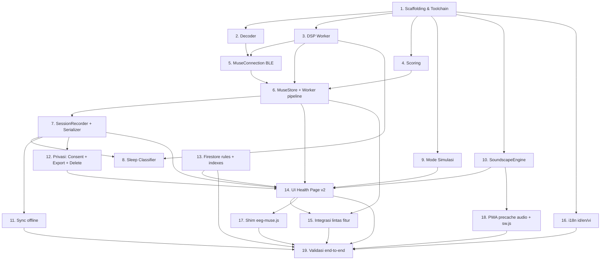

# Implementation Plan

## Overview

Rencana implementasi 19 task induk untuk fitur Muse S Gen 2 di halaman Health. Setiap task dipecah menjadi sub-task yang dapat dieksekusi langsung, dengan referensi silang ke `requirements.md` (R1–R23) dan `design.md` (§ 1–18).

> Hubungan ke spec: setiap task mereferensikan requirements pada `requirements.md` (R1–R23) dan bagian desain pada `design.md` (§ 1–18).
> Konvensi:
> - Task induk = milestone besar; sub-task = unit kerja yang siap di-eksekusi.
> - Property-based tests (PBT) menggunakan `fast-check` (Vitest sebagai runner; nol-config, ESM-friendly, tidak mengganggu pola repo karena hanya berjalan via `npm test`).
> - Semua modul baru ditempatkan di `js/muse/` (lihat design § 2).
> - Feature flag `?muse=v2` atau `localStorage.museV2 = '1'` (design § 17.3) — default OFF sampai task 14 selesai.

## Tasks

---

- [x] 1. Persiapan repo, scaffolding, dan toolchain testing
  - Sub-tasks:
    - [x] 1.1 Buat folder `js/muse/` dengan README singkat berisi peta modul (design § 2).
    - [x] 1.2 Tambahkan `vitest` + `fast-check` ke `package.json` sebagai devDependencies; konfigurasi `vitest.config.js` minimal (jsdom env, alias `@/` → `js/`).
    - [x] 1.3 Tambahkan script `npm test` dan `npm run test:watch`.
    - [x] 1.4 Buat folder `tests/muse/` dengan satu smoke test (`smoke.test.js`) untuk memastikan toolchain berfungsi.
    - [x] 1.5 Tambahkan feature flag helper di `js/muse/flags.js` (`isMuseV2Enabled()`); export ke `window.MuseFlags`.
  - Validasi: `npm test` hijau pada smoke test.
  - _Requirements: kerangka untuk R1–R23_
  - _Design: § 17.3 (feature flag), § 16 (testing strategy)_

- [x] 2. Modul Decoder paket Muse (pure)
  - Sub-tasks:
    - [x] 2.1 Implementasikan `js/muse/decoder.js` dengan `decodeEegPacket`, `decodePpgPacket`, `decodeImuPacket`, `decodeBattery` (design § 4.4).
    - [x] 2.2 Tulis unit test `tests/muse/decoder.test.js` dengan paket sampel referensi (EEG 12-byte, PPG, IMU, battery).
    - [x] 2.3 Tulis PBT `tests/muse/decoder.pbt.js`: untuk EEG, `decodeEegPacket(encodeEegPacket(samples)) ≈ samples` (toleransi ±0.5 µV karena kuantisasi 10-bit).
    - [x] 2.4 Tambahkan validasi panjang paket: jika panjang salah → throw `MalformedPacketError` deskriptif (R22.1).
  - Validasi: semua test hijau.
  - _Requirements: 4.1, 5.1, 7.1, 22.1_
  - _Design: § 4.2, § 4.4_

- [ ] 3. DSP Worker — filter, FFT, band power, BR, peak detect
  - Sub-tasks:
    - [x] 3.1 Implementasikan `js/muse/dsp/filters.js`: biquad cascade BP 0.5–45 Hz, notch 50/60 Hz (design § 5.1). Pure functions dengan state per-instance.
    - [x] 3.2 Implementasikan `js/muse/dsp/fft.js`: ekstrak Cooley-Tukey radix-2 dari `eeg-muse.js` ke modul terpisah dengan API `fftMag(samples, N)`.
    - [x] 3.3 Implementasikan `js/muse/dsp/bandpower.js`: integrasi PSD per band Δ/θ/α/SMR/β/γ (design § 5.3).
    - [x] 3.4 Implementasikan `js/muse/dsp/peak.js`: Pan-Tompkins simplified (design § 5.5) dengan refractory 300 ms.
    - [x] 3.5 Implementasikan `js/muse/dsp/br.js`: estimasi Breath_Rate dari PPG envelope + IMU fallback (design § 5.4).
    - [x] 3.6 Buat `js/muse/dsp.worker.js` yang menggabungkan filters→fft→bandpower per kanal dan peak→br untuk PPG, posting `{type:"metrics", powers, hr, hrv, br, contact}` (throttle 10 Hz).
    - [x] 3.7 Unit tests: `filters.test.js` (sinus 50 Hz dengan notch ON → atenuasi ≥40 dB), `fft.test.js` (sinus 10 Hz murni → puncak di bin Alpha), `bandpower.test.js`, `peak.test.js` (gelombang ECG sintetik → HR ≈ 60), `br.test.js`.
    - [~] 3.8 PBT `dsp.pbt.js`: ∀ sinus dengan f∈[1,40 Hz], puncak band sesuai f berada dalam ±1 bin.
  - Validasi: test hijau, latency main-thread tidak terdampak.
  - _Requirements: 4.3, 4.4, 4.7, 5.1, 5.2, 5.3, 6.1, 6.2, 19.2_
  - _Design: § 3.3, § 5_

- [ ] 4. Modul Scoring (pure)
  - Sub-tasks:
    - [~] 4.1 Implementasikan `js/muse/scoring.js` dengan: `mind`, `heart`, `body`, `breath`, `calm`, `focus`, `stress` (design § 6).
    - [~] 4.2 Heart_Score menggunakan baseline RMSSD: terima `{rmssd, baseline:{mean,sd}, provisional}` dan kembalikan `{score, provisional}`.
    - [~] 4.3 Stress_Score: bobot 60/25/15; jika GSR tidak tersedia → 70/30 (R13.1 design § 6).
    - [~] 4.4 Unit tests `tests/muse/scoring.test.js` dengan tabel skenario calm/neutral/stressed/focused (design § 6 tabel sanity, toleransi ±2).
    - [~] 4.5 PBT `tests/muse/scoring.pbt.js`:
      - **Property 3 (Score clamp):** ∀ inputs → 0 ≤ skor ≤ 100.
      - **Property 4 (Body_Score monotonicity):** mag1 ≤ mag2 ⇒ Body(mag1) ≥ Body(mag2).
      - **Property 6 (Focus_Score linearity):** kontinu naik di r∈[0.5,1.5].
  - Validasi: test hijau termasuk PBT.
  - _Requirements: 8.1, 8.2, 8.3, 8.4, 8.5, 8.6, 10.1, 13.1_
  - _Design: § 6, § 16.2 (Property 3, 4, 6)_

- [ ] 5. MuseConnection (BLE pairing + reconnect)
  - Sub-tasks:
    - [~] 5.1 Implementasikan `js/muse/connection.js` dengan API `precheck/connect/disconnect/reconnect/getStatus/on/off` (design § 4.5).
    - [~] 5.2 `precheck()`: `navigator.bluetooth.getAvailability()` dengan timeout 200 ms (R1.1) dan deteksi konteks secure (R1.3).
    - [~] 5.3 `connect()`: requestDevice filter `namePrefix:"Muse"` + `optionalServices:[MUSE_SERVICE]` (R2.1); subscribe seluruh karakteristik dan kirim `p21/s/d` (R2.3, R2.4); deteksi model bukan Gen 2 (R2.5); pesan error per jenis (R2.6).
    - [~] 5.4 Reconnect dengan exponential backoff 2/4/8/16/32 s, per-attempt timeout 10 s (R3.1, design § 3.2).
    - [~] 5.5 Stalled detection: tidak ada paket AF7 > 10 s → trigger reconnect (R3.5).
    - [~] 5.6 `disconnect()`: kirim `h`, putus GATT, bersihkan buffer dalam < 2 s (R2.8).
    - [~] 5.7 Unit tests dengan mock `navigator.bluetooth`: success path, cancel chooser (R2.2), error path per jenis (R2.6), reconnect timeline.
    - [~] 5.8 Integration test `reconnect.spec.js` (design § 16.3) — mock `gattserverdisconnected` 4 kali → reconnect berhasil di percobaan ke-4; kasus 5× gagal → finalize interrupted.
  - Validasi: test hijau, kode lulus lint.
  - _Requirements: 1.1, 1.2, 1.3, 1.4, 2.1–2.8, 3.1–3.7, 22.1, 22.2_
  - _Design: § 3.1, § 3.2, § 4.5_

- [ ] 6. MuseStore + integrasi Worker
  - Sub-tasks:
    - [~] 6.1 Buat `js/muse/store.js` (pola seperti `stressStore.js`) dengan state `{status, deviceName, battery, contact[], scores, ppg, br, imu, stressScore}` dan `subscribe(selector, cb)` + emit throttle 10 Hz (R19.3).
    - [~] 6.2 Pipeline data: `MuseConnection` → `decoder` (main) → `dsp.worker` via `postMessage` transferable → `MuseStore`.
    - [~] 6.3 Health checks kontak elektroda di worker (variansi > ±1500 µV > 1 s → `poor_contact`) dengan latency deteksi ≤250 ms (R4.5).
    - [~] 6.4 Buffer EEG ring 512 sampel/kanal; jika total > 50 MB → FIFO drop, console.warn (R19.4, design § 13).
    - [~] 6.5 Unit tests `store.test.js`: throttle, subscriber lifecycle, FIFO trim.
  - Validasi: test hijau; manual smoke menggunakan mode simulasi (lihat task 9) menampilkan skor real-time.
  - _Requirements: 4.2, 4.4, 4.5, 4.6, 19.3, 19.4_
  - _Design: § 2, § 13_

- [ ] 7. SessionRecorder + Round-trip Serializer
  - Sub-tasks:
    - [~] 7.1 Implementasikan `js/muse/sessions.js` dengan `start(opts)`, `addEpoch(payload)`, `finalize()`, `discard()`; tipe meditation/focus/sleep/breath.
    - [~] 7.2 Logika "sesi terlalu pendek < 60 s → discard + toast" (R9.6); `interrupted/sensorless/sensorDisconnectedDuringSession` flags (R3.4, R9.7, R9.8).
    - [~] 7.3 Snapshot tiap 10 s ke IndexedDB `liveSnapshots` (R17.1, design § 7.9).
    - [~] 7.4 Implementasikan `js/muse/serializer.js` dengan `stringifyJson`, `parseJson`, `stringifyCsv`, `parseCsv` (design § 8). Tangani `UnsupportedSchemaError` deskriptif (R23.4).
    - [~] 7.5 Unit tests `sessions.test.js`: lifecycle, durasi <60s discard, snapshot.
    - [~] 7.6 PBT `serializer.pbt.js`:
      - **Property 1 (JSON round-trip):** `parseJson(stringifyJson(s)) ≡ s`.
      - **Property 2 (CSV round-trip):** `parseCsv(stringifyCsv(rows)) ≡ rows`.
      - **Property 5 (Parser idempotency):** `parse(parse(x).stringify()) ≡ parse(x)`.
  - Validasi: test hijau termasuk PBT.
  - _Requirements: 9.1, 9.5, 9.6, 9.7, 9.8, 14.1, 16.1, 16.2, 16.6, 17.1, 23.1–23.7_
  - _Design: § 7, § 8, § 16.2 (Property 1, 2, 5)_

- [ ] 8. Sleep Stage Classifier + Hipnogram
  - Sub-tasks:
    - [~] 8.1 Implementasikan `js/muse/sleep-classifier.js` (di worker) dengan rule R11.2 dan output `{stage, provisional}`.
    - [~] 8.2 Hitung `sleepEfficiency` = (Σ epoch non-awake / Σ epoch) × 100 (R11.4).
    - [~] 8.3 Hitung `arousal` = jumlah transisi non-awake → awake yang panjangnya < 4 epoch (R11.4).
    - [~] 8.4 Map ke `SleepTracker.stages` existing (design § 12.5).
    - [~] 8.5 Evening Routine recommender (R11.8): pilih satu rekomendasi berdasarkan urutan prioritas eksplisit.
    - [~] 8.6 Unit tests `sleep-classifier.test.js` dengan epoch deterministik; `evening-routine.test.js` untuk semua cabang.
  - Validasi: test hijau.
  - _Requirements: 7.1, 7.2, 7.3, 7.4, 7.5, 11.1, 11.2, 11.3, 11.4, 11.5, 11.6, 11.7, 11.8_
  - _Design: § 3.5, § 12.5_

- [ ] 9. Mode Simulasi
  - Sub-tasks:
    - [~] 9.1 Implementasikan `js/muse/sim.js` dengan skenario `calm/stressed/focused` (design § 10) dan API yang menyamai `MuseConnection` (drop-in).
    - [~] 9.2 Update 1 Hz; nilai dengan jitter sinusoidal + noise gaussian kecil; rentang sesuai tabel skenario.
    - [~] 9.3 Aktivasi via `?simulate=muse` atau tombol "Mode Demo" pada kartu Muse.
    - [~] 9.4 Tidak menulis Firestore kecuali user "Simpan sebagai uji coba" (R20.5).
    - [~] 9.5 Unit test `sim.test.js`: skenario calm setelah 60 detik → Calm_Score ≥ 75; cleanup interval setelah `stop()`.
  - Validasi: test hijau; UI menampilkan badge DEMO persistent.
  - _Requirements: 20.1–20.5_
  - _Design: § 10_

- [ ] 10. SoundscapeEngine
  - Sub-tasks:
    - [~] 10.1 Implementasikan `js/muse/soundscape.js` dengan AudioContext, 4 preset, 3 layer per preset (design § 9.1, § 9.5).
    - [~] 10.2 Volume adaptif inversely proportional terhadap Mind_Score (R9.2, design § 9.2).
    - [~] 10.3 Reward cue saat Mind_Score ≥ 80 selama > 15 s (cooldown 30 s) (R9.3).
    - [~] 10.4 RMS guard ±3 dB via `AudioWorklet` (R12.3).
    - [~] 10.5 AudioContext unlock jika `state==='suspended'` (R12.4).
    - [~] 10.6 Fade-out 2000 ms ±100 ms saat stop (R12.6).
    - [~] 10.7 Tambahkan 12 file audio ke folder `audio/muse/` (placeholder OGG selama development) dan ke `STATIC_ASSETS` di `sw.js` (design § 9.5).
    - [~] 10.8 Unit tests `soundscape.test.js` dengan `AudioContext` mock.
  - Validasi: test hijau; integrasi manual smoke (autoplay-blocked browser tab).
  - _Requirements: 9.2, 9.3, 12.1–12.6_
  - _Design: § 9_

- [ ] 11. Sync offline (IndexedDB → Firestore)
  - Sub-tasks:
    - [~] 11.1 Implementasikan `js/muse/sync.js` dengan IndexedDB store sesuai design § 7.9.
    - [~] 11.2 Listener `online`/`offline` dengan threshold deteksi 3 s; saat online stable 5 s → flush kronologis (R17.2).
    - [~] 11.3 Retry 5/10/20 s, max 3× per dokumen (R17.4); tampilkan banner "Beberapa sesi belum tersinkron" + tombol retry manual.
    - [~] 11.4 Quota guard: trim `liveSnapshots` jika usage > 90% (design § 7.9).
    - [~] 11.5 Integration test `offline-flush.spec.js` (design § 16.3).
  - Validasi: test hijau.
  - _Requirements: 17.1–17.5_
  - _Design: § 3.6, § 7.9_

- [ ] 12. Privasi: Consent dialog + ekspor + hapus data
  - Sub-tasks:
    - [~] 12.1 Implementasikan `js/muse/consent.js` (dialog, simpan ke `users/{uid}/museConsent/profile`) (R18.1, R18.2).
    - [~] 12.2 Menu "Privasi & Data" pada Health Page: ekspor JSON/CSV (pakai `serializer.js`), hapus sesi tertentu, hapus seluruh data Muse (R18.3).
    - [~] 12.3 Hapus seluruh data Muse: chunked WriteBatch ≤500 ops, ringkasan jumlah dokumen (R18.4, R18.6, design § 3.7).
    - [~] 12.4 Sanitasi user-content dengan `textContent`/sanitizer; tidak pernah `innerHTML` (R22.5).
    - [~] 12.5 Unit test `consent.test.js` dan `delete-flow.test.js` (mock Firestore).
    - [~] 12.6 Integration test `consent-flow.spec.js`: cancel → tidak ada doc; agree → doc tersimpan.
  - Validasi: test hijau.
  - _Requirements: 18.1–18.8, 22.5_
  - _Design: § 3.7, § 14_

- [ ] 13. Persistensi Firestore (rules, indexes)
  - Sub-tasks:
    - [~] 13.1 Update `firestore.indexes.json` dengan 5 indeks baru (design § 7.7).
    - [~] 13.2 Update `firestore.rules` dengan match deeper untuk `epochs/` (design § 7.8).
    - [~] 13.3 Verifikasi koleksi baru di bawah `users/{uid}/...` tercover oleh wildcard existing.
    - [~] 13.4 Manual test melalui Firebase emulator (jika tersedia) atau staging project.
  - Validasi: deploy rules tanpa error; kueri sample dari `users/{uid}/meditationSessions` berhasil.
  - _Requirements: 14.1, 16.1–16.8, 17.4_
  - _Design: § 7.7, § 7.8_

- [ ] 14. UI Health Page v2 + integrasi
  - Sub-tasks:
    - [~] 14.1 Update `js/views.js` dengan template `health-v2` sesuai layout design § 11.1; render melalui flag.
    - [~] 14.2 Update `js/health.js` untuk menginisialisasi `MuseConnection` v2, `MuseStore`, `SessionRecorder`, `SoundscapeEngine` saat flag aktif.
    - [~] 14.3 Implementasikan `RingGauge` dengan `requestAnimationFrame` (R19.5) di file kecil `js/muse/ui/ring-gauge.js`.
    - [~] 14.4 Kartu HR/HRV (R5.4, R5.5, R5.7); kartu Stress dengan delta (R13.5); kartu Sleep launcher.
    - [~] 14.5 Tab Riwayat (filter tipe + range, 30 sesi) (R14.3) dan tab Insight (Hari Ini, mingguan Chart.js, heatmap bulanan) (R15.1–R15.5).
    - [~] 14.6 Banner offline (R17.4) + dialog "Mode Tanpa Sensor" (R9.7) + badge DEMO (R20.2).
    - [~] 14.7 Tab order aksesibilitas (R21.2) dan `aria-label` 5–100 chars (R21.1).
    - [~] 14.8 Smoke test E2E manual: `?simulate=muse&scenario=calm` 2 menit → Calm_Score rata-rata ≥ 80.
  - Validasi: smoke test lulus, lint hijau, frame rate ≥ 30 fps di DevTools throttling.
  - _Requirements: 1.5, 2.7, 4.6, 5.4, 5.5, 5.7, 9.1, 9.4, 9.7, 9.8, 11.4, 13.5, 14.2, 14.3, 15.1–15.5, 17.4, 19.1, 19.5, 20.2, 21.1, 21.2, 21.3_
  - _Design: § 11_

- [ ] 15. Integrasi Lintas Fitur
  - Sub-tasks:
    - [~] 15.1 `js/yoga.js`: tambahkan `openWithContext({entryStressScore})` dan emit `onSessionEnd` ke `MuseStore`; rekomendasi gating berdasarkan Stress_Score (R13.2, R13.3).
    - [~] 15.2 `js/academy.js`: subscribe Focus_Score saat materi diputar, tag porsi materi dengan fokus tinggi (R10.5).
    - [~] 15.3 `js/journal.js`: terima `openDraft({title, period, summary})` dari kartu Insight (R15.5).
    - [~] 15.4 `js/dashboard.js` (atau modul SynaScore): tambahkan kontribusi Calm/Focus/Stress mingguan (design § 12.4).
    - [~] 15.5 `js/sleep-tracker.js`: tambahkan opsional source `"muse"`; tetap pertahankan path lama untuk fallback IMU-only.
    - [~] 15.6 Integration tests cross-feature: stress > 70 selama 5 menit → kartu yoga; sesi yoga selesai → delta Stress_Score ditampilkan.
  - Validasi: test hijau; tidak ada regresi pada fitur lama.
  - _Requirements: 10.4, 10.5, 13.2, 13.3, 13.4, 13.5, 13.6, 13.7, 15.5, 7.x cross-link_
  - _Design: § 12_

- [ ] 16. i18n: tambahan key Muse (id/en/vi)
  - Sub-tasks:
    - [~] 16.1 Tambahkan namespace `muse.*` di `js/i18n.js` untuk Bahasa Indonesia (design § 15 tabel).
    - [~] 16.2 Tambahkan terjemahan English dan Vietnamese.
    - [~] 16.3 Pastikan fallback ke Indonesia saat key missing di vi/en (R21.4).
    - [~] 16.4 Unit test `i18n-muse.test.js`: setiap key memiliki ketiga bahasa; tidak ada string kosong.
  - Validasi: test hijau.
  - _Requirements: 21.4, 21.6_
  - _Design: § 15_

- [ ] 17. Kompatibilitas: refactor `eeg-muse.js` menjadi shim adapter
  - Sub-tasks:
    - [~] 17.1 Pindahkan logika decoder/FFT/scoring lama ke modul baru (sudah dilakukan di task 2–4).
    - [~] 17.2 Ubah `js/eeg-muse.js` menjadi shim: jika flag v2 aktif → ekspor `MuseV2Adapter`; jika tidak → behaviour lama (design § 17.1).
    - [~] 17.3 `MuseV2Adapter`: meneruskan event ke kontrak lama `{powers, stressLevel, focusState, battery}` agar `multi-ble.js` tidak pecah.
    - [~] 17.4 Update `js/multi-ble.js`: subscribe ke event `MuseStore` saat v2, tetap kompatibel dengan `MuseEEG.onMetrics` saat v1.
    - [~] 17.5 Smoke test: matikan flag → semua perilaku lama tetap berjalan; nyalakan flag → fitur v2 aktif.
  - Validasi: test regresi pada `multi-ble.js` (tambah `multi-ble.test.js` jika belum ada).
  - _Requirements: kompat dengan kode existing_
  - _Design: § 17.1_

- [ ] 18. PWA: precache audio + Service Worker update
  - Sub-tasks:
    - [~] 18.1 Update `sw.js` `STATIC_ASSETS` dengan 12 file audio Muse (design § 9.5).
    - [~] 18.2 Bump `APP_VERSION` agar cache di-invalidate.
    - [~] 18.3 Pastikan total cache ≤ 60 MB; jika `cache.addAll` gagal sebagian → tetap `skipWaiting()` (jangan abort install).
    - [~] 18.4 Verifikasi offline manual: airplane mode + sesi simulasi → soundscape tetap berjalan.
  - Validasi: smoke offline lulus.
  - _Requirements: 17.3_
  - _Design: § 9.5_

- [ ] 19. Validasi end-to-end & polish
  - Sub-tasks:
    - [~] 19.1 Jalankan seluruh `npm test` (unit + PBT + integration) → semua hijau.
    - [~] 19.2 Jalankan E2E manual dengan flag v2:
      - 19.2.a Pairing dengan Muse fisik (jika tersedia) atau `?simulate=muse&scenario=calm`.
      - 19.2.b Sesi meditasi 5 menit → grafik mind, ring gauge, soundscape, simpan ke Firestore.
      - 19.2.c Sesi sleep singkat 30 menit (boleh fast-forward via simulasi) → hipnogram, evening routine.
      - 19.2.d Skenario stress → kartu Yoga muncul, sesi yoga → delta Stress_Score.
      - 19.2.e Hapus seluruh data Muse → ringkasan jumlah dokumen.
    - [~] 19.3 Periksa frame rate ≥ 30 fps via DevTools Performance.
    - [~] 19.4 Periksa accessibility audit (Lighthouse / axe) untuk Health Page → tidak ada error kritis.
    - [~] 19.5 Aktifkan flag default di `js/muse/flags.js` setelah review user.
  - Validasi: checklist E2E lulus, audit aksesibilitas tanpa error kritis.
  - _Requirements: seluruh R1–R23_
  - _Design: § 16.4, § 11, § 13_

---

## Task Dependency Graph

```json
{
  "waves": [
    { "wave": 1, "tasks": ["1"] },
    { "wave": 2, "tasks": ["2", "3", "4", "9", "10", "13", "16"] },
    { "wave": 3, "tasks": ["5"] },
    { "wave": 4, "tasks": ["6", "8"] },
    { "wave": 5, "tasks": ["7"] },
    { "wave": 6, "tasks": ["11", "12", "17", "18"] },
    { "wave": 7, "tasks": ["14"] },
    { "wave": 8, "tasks": ["15"] },
    { "wave": 9, "tasks": ["19"] }
  ],
  "dependencies": {
    "2":  ["1"],
    "3":  ["1"],
    "4":  ["1"],
    "5":  ["2", "3"],
    "6":  ["3", "4", "5"],
    "7":  ["6"],
    "8":  ["3", "7"],
    "9":  ["1"],
    "10": ["1"],
    "11": ["7"],
    "12": ["7"],
    "13": [],
    "14": ["6", "7", "9", "10", "12", "13"],
    "15": ["6", "14"],
    "16": ["1"],
    "17": ["14"],
    "18": ["10"],
    "19": ["11", "13", "14", "15", "16", "17", "18"]
  }
}
```



## Notes

## Catatan eksekusi

- Task 2, 3, 4 saling independen pada level fungsi murni → dapat dieksekusi paralel.
- Task 5 (BLE) bergantung pada task 2 (decoder) & task 3 (worker pipeline minimal).
- Task 6 (Store) bergantung pada task 5 dan task 3.
- Task 7 (SessionRecorder) bergantung pada task 6.
- Task 8 (Sleep classifier) dapat dieksekusi paralel dengan task 7.
- Task 9 (Sim) dapat dieksekusi paralel dengan task 5; berguna sebagai fixture E2E.
- Task 10 (Soundscape) independen.
- Task 11 (Sync) bergantung pada task 7.
- Task 12 (Privasi) bergantung pada task 7 (untuk ekspor).
- Task 13 (Firestore) sebaiknya selesai sebelum task 14 (UI) untuk validasi end-to-end.
- Task 14 (UI) adalah integrator besar — bergantung pada task 6, 7, 9, 10, 12.
- Task 15 (Cross-feature) bergantung pada task 6 dan task 14 minimal kerangka.
- Task 16 (i18n), 17 (shim), 18 (PWA) dapat dieksekusi kapan saja setelah task 14.
- Task 19 (validasi akhir) menutup semuanya.
